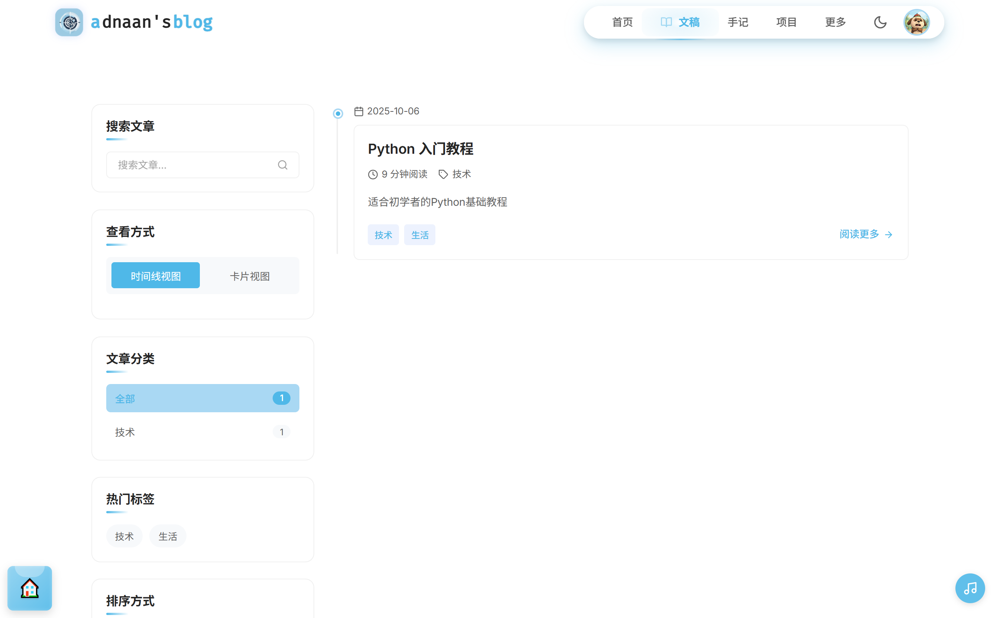

# 🚀 光阴副本博客系统

> **一个集 AI 智能、实时通信、全栈架构于一体的现代化博客平台**

[](LICENSE)
[](https://nodejs.org/)
[](https://react.dev/)
[](https://www.typescriptlang.org/)

## 📖 目录

- [项目简介](#-项目简介)
- [核心特性](#-核心特性)
- [技术栈](#-技术栈)
- [项目结构](#-项目结构)
- [快速开始](#-快速开始)
- [环境配置](#-环境配置)
- [开发指南](#-开发指南)
- [部署指南](#-部署指南)
- [功能展示](#-功能展示)
- [贡献指南](#-贡献指南)
- [许可证](#-许可证)

## 🎯 项目简介

光阴副本博客系统是一个现代化的全栈博客平台，集成了 AI 智能写作、实时通信、个性化推荐等前沿功能。采用前后端分离架构，支持多端适配，提供企业级的安全性和性能。

### 🌟 核心亮点

- 🤖 **AI 驱动** - 集成 LangChain + OpenAI，提供智能写作、内容分析、实时对话
- ⚡ **实时通信** - 基于 Socket.IO 的实时聊天、通知、在线状态
- 🎨 **极致体验** - React 19 + Framer Motion，60fps 流畅动画
- 📱 **移动优先** - 完美适配手机、平板、桌面所有设备
- 🔒 **企业级安全** - JWT 认证、密码加密、XSS 防护、速率限制
- 🚀 **高性能** - Redis 缓存、数据库优化、首屏加载 <1s

### 🖼️ 运行效果





### 🌐 在线体验

> **🚀 在线演示**: [http://www.adnaan.cn](http://www.adnaan.cn)
>
> **📱 移动端**: 完美适配手机、平板、桌面
>
> **🤖 AI 功能**: 智能写作、实时聊天、内容分析
>
> **⚡ 性能**: 首屏加载 <1s，60fps 流畅动画

## ✨ 核心特性

### 🤖 AI 智能功能

- **AI 写作助手** - 基于 GPT 的智能内容生成，让创作更高效
- **智能润色** - 自动语法检查、风格优化、内容建议
- **智能标签** - AI 自动提取关键词、生成标签、分类建议
- **内容分析** - 自动生成文章摘要、阅读时间预估、可读性评分
- **实时对话** - 基于 LangChain 的智能对话系统

### ⚡ 实时互动

- **实时聊天** - 基于 Socket.IO 的即时通讯系统
- **实时通知** - 点赞、评论、关注等实时推送
- **在线用户** - 显示当前在线用户，增强社区感
- **实时同步** - 多端数据实时同步，永不丢失

### 🎨 视觉体验

- **动态主题** - 支持自定义主题色彩，实时预览
- **微动画** - 60fps 流畅动画，每个细节都精心设计
- **移动优先** - 完美适配所有设备，触摸体验优化
- **深色模式** - 护眼深色主题，自动切换

### 🚀 性能与安全

- **极速加载** - Vite 构建，首屏加载 <1s
- **企业级安全** - JWT 认证、密码加密、XSS 防护
- **高并发** - Redis 缓存、数据库优化、CDN 加速
- **API 文档** - 完整的 Swagger API 文档

## 🛠️ 技术栈

### 前端技术

| 技术             | 版本   | 说明         |
| ---------------- | ------ | ------------ |
| React            | 19.0.0 | UI 框架      |
| TypeScript       | 5.7    | 类型安全     |
| Vite             | 6.3    | 构建工具     |
| Redux Toolkit    | 2.7    | 状态管理     |
| React Router     | 7.5    | 路由管理     |
| TipTap           | 3.6    | 富文本编辑器 |
| Framer Motion    | 12.7   | 动画库       |
| Socket.IO Client | 4.8    | 实时通信     |
| Axios            | 1.8    | HTTP 客户端  |

### 后端技术

| 技术      | 版本     | 说明       |
| --------- | -------- | ---------- |
| Node.js   | >=18.0.0 | 运行环境   |
| Express   | 4.21     | Web 框架   |
| Sequelize | 6.37     | ORM 框架   |
| MySQL     | >=8.0    | 数据库     |
| Redis     | >=6.0    | 缓存数据库 |
| Socket.IO | 4.8      | 实时通信   |
| LangChain | 1.0      | AI 框架    |
| OpenAI    | 4.20     | AI 服务    |
| JWT       | 9.0      | 身份认证   |
| Winston   | 3.8      | 日志系统   |

### 开发工具

- **ESLint** - 代码质量检查
- **Prettier** - 代码格式化
- **Swagger** - API 文档生成
- **Docker** - 容器化部署

## 📁 项目结构

```
blog/
├── frontend/                 # 前端项目
│   ├── src/
│   │   ├── components/      # React 组件
│   │   ├── pages/           # 页面组件
│   │   ├── layouts/         # 布局组件
│   │   ├── router/          # 路由配置
│   │   ├── store/           # Redux 状态管理
│   │   ├── hooks/           # 自定义 Hooks
│   │   ├── utils/           # 工具函数
│   │   ├── types/           # TypeScript 类型定义
│   │   ├── styles/          # 样式文件
│   │   └── theme/           # 主题配置
│   ├── public/              # 静态资源
│   ├── package.json
│   └── vite.config.ts
│
├── backend/                 # 后端项目
│   ├── config/              # 配置文件
│   ├── controllers/         # 控制器
│   ├── services/            # 业务逻辑层
│   ├── models/              # 数据模型
│   ├── routes/              # 路由定义
│   ├── middlewares/         # 中间件
│   ├── utils/               # 工具函数
│   ├── workers/             # 后台任务
│   ├── scripts/             # 脚本文件
│   ├── docs/                # 文档
│   ├── logs/                # 日志文件
│   ├── package.json
│   └── app.js
│
├── LICENSE                  # 许可证
└── README.md                # 项目说明
```

## 🚀 快速开始

### 环境要求

- **Node.js** >= 18.0.0
- **MySQL** >= 8.0
- **Redis** >= 6.0
- **npm** >= 9.0

### 1. 克隆项目

```bash
git clone https://gitee.com/adnaan/blog.git
cd blog
```

### 2. 后端设置

```bash
# 进入后端目录
cd backend

# 安装依赖
npm install

# 复制环境变量文件
cp example.env .env

# 编辑 .env 文件，配置数据库、Redis 等信息
# 数据库配置
DB_HOST=localhost
DB_USER=root
DB_PASSWORD=your_password
DB_NAME=adnaan_blog
DB_PORT=3306

# Redis 配置
REDIS_HOST=localhost
REDIS_PORT=6379

# JWT 配置
JWT_SECRET=your_jwt_secret

# AI 配置（可选）
AI_PROVIDER=zhipu
ZHIPU_API_KEY=your_api_key

# 初始化数据库
# 执行 scripts/adnaan_blog.sql 创建数据库表结构

# 启动开发服务器
npm run dev

# 后端服务运行在 http://localhost:8200
```

### 3. 前端设置

```bash
# 进入前端目录（新开一个终端）
cd frontend

# 安装依赖
npm install

# 复制环境变量文件
cp example.env .env

# 编辑 .env 文件
VITE_API_BASE_URL=/api
VITE_API_PORT=3000
VITE_PROXY_TARGET=http://localhost:8200
VITE_SOCKET_URL=http://localhost:3000

# 启动开发服务器
npm run dev

# 前端服务运行在 http://localhost:3000
```

### 4. 访问应用

- **前端地址**: http://localhost:3000
- **后端 API**: http://localhost:8200
- **API 文档**: http://localhost:8200/api-docs

## ⚙️ 环境配置

### 后端环境变量

详细配置说明请参考 `backend/example.env`：

```env
# 服务器配置
NODE_ENV=development
PORT=8200

# 数据库配置
DB_HOST=localhost
DB_USER=root
DB_PASSWORD=your_password
DB_NAME=adnaan_blog
DB_PORT=3306

# JWT 配置
JWT_SECRET=your_jwt_secret
JWT_EXPIRES_IN=1d
JWT_REFRESH_EXPIRES_IN=7d

# Redis 配置
REDIS_HOST=localhost
REDIS_PORT=6379
REDIS_DB=1

# CORS 配置
ALLOWED_ORIGINS=http://localhost:3000,http://localhost:5173

# Socket.IO 配置
SOCKET_IO_ENABLED=true
SOCKET_IO_AUTH_KEY=your_auth_key

# AI 配置
AI_PROVIDER=zhipu
ZHIPU_API_KEY=your_api_key
AI_TEMPERATURE=0.7
AI_MAX_TOKENS=1000
```

### 前端环境变量

详细配置说明请参考 `frontend/example.env`：

```env
# API 配置
VITE_API_BASE_URL=/api
VITE_API_PORT=3000
VITE_PROXY_TARGET=http://localhost:8200

# Socket.IO 配置
VITE_SOCKET_URL=http://localhost:3000
VITE_SOCKET_IO_AUTH_KEY=your_auth_key

# 请求配置
VITE_REQUEST_TIMEOUT=30000
```

## 💻 开发指南

### 开发脚本

#### 后端开发

```bash
cd backend

# 启动开发服务器（自动重启）
npm run dev

# 启动生产服务器
npm start

# 代码格式化
npm run format:all

# 代码检查
npm run lint

# 数据库种子数据
npm run db:seed
```

#### 前端开发

```bash
cd frontend

# 启动开发服务器
npm run dev

# 构建生产版本
npm run build

# 类型检查 + 构建
npm run build:type-check

# 预览生产构建
npm run preview

# 代码格式化
npm run format:all

# 代码检查
npm run lint
```

### 代码规范

- **TypeScript** - 前端 100% TypeScript 覆盖
- **ESLint** - 代码质量检查
- **Prettier** - 统一代码格式
- **提交前** - 运行 `npm run format:all` 和 `npm run lint`

### API 文档

后端集成了 Swagger API 文档，启动后端服务后访问：

```
http://localhost:8200/api-docs
```

## 🚢 部署指南

### Docker 部署

项目支持 Docker 容器化部署，详细说明请参考根目录的 `docker-compose.yml` 和 `docker/` 目录。

### 生产环境构建

#### 前端构建

```bash
cd frontend
npm run build
# 构建产物在 dist/ 目录
```

#### 后端部署

```bash
cd backend
npm install --production
npm start
```

### 环境变量

生产环境需要配置相应的环境变量，确保：

- 数据库连接正确
- Redis 连接正确
- JWT Secret 安全
- CORS 配置允许的域名
- AI API Key 配置（如使用 AI 功能）

## 🎨 功能展示

### 🏠 智能首页

- **智能推荐** - 基于用户行为的个性化内容推荐
- **实时数据** - 文章数量、浏览量、用户活跃度实时统计
- **智能搜索** - 全文搜索、标签搜索、AI 语义搜索
- **响应式设计** - 完美适配手机、平板、桌面所有设备

### 📝 AI 写作系统

- **富文本编辑** - 支持图片、视频、代码块、表格等丰富内容
- **AI 写作助手** - 智能续写、内容优化、风格调整
- **智能标签** - AI 自动提取关键词、生成标签、分类建议
- **版本控制** - 文章版本历史、自动保存、恢复功能
- **数据分析** - 阅读时间预估、可读性评分、SEO 优化建议

### 💬 实时互动

- **实时聊天** - 基于 Socket.IO 的即时通讯系统
- **智能通知** - 点赞、评论、关注等实时推送
- **在线用户** - 显示当前在线用户，增强社区感
- **移动优化** - 完美的移动端聊天体验

### 📖 智能手记

- **心情记录** - 支持心情标签、天气、地点、音乐记录
- **私密内容** - 个人私密手记，支持公开/私密切换
- **智能标签** - AI 自动分类、标签推荐
- **时间线** - 按时间顺序展示手记内容
- **智能搜索** - 快速查找历史手记，支持语义搜索

### 🤖 AI 智能助手

- **智能写作** - AI 辅助内容生成和优化
- **智能聊天** - 基于 LangChain 的对话系统
- **内容分析** - 自动提取关键词、生成摘要
- **批量处理** - 异步任务队列，支持大批量操作
- **配额管理** - 用户使用配额和限制管理

### 👤 个人中心

- **个性化资料** - 个人信息、头像、简介、主题定制
- **数据统计** - 个人数据可视化展示，成长轨迹
- **成就系统** - 用户等级、徽章、成就解锁
- **文件管理** - 个人文件上传、存储管理、批量操作
- **消息中心** - 系统通知、私信、评论回复

## 📊 项目规模

### 代码规模

- **前端组件**: 80+ 个 React 组件，100% TypeScript 覆盖
- **API 接口**: 50+ 个 RESTful API，完整 Swagger 文档
- **数据库表**: 20+ 个数据表，完整关系设计
- **代码行数**: 50,000+ 行代码，高质量架构

### 技术亮点

- **AI 集成**: 5+ 个 AI 功能模块，智能写作、聊天、分析
- **实时通信**: Socket.IO + Redis，支持万级并发
- **性能优化**: 首屏加载 <1s，Lighthouse 评分 95+
- **安全等级**: 企业级安全，JWT + 加密 + 防护
- **响应式**: 4 个断点，完美适配所有设备

### 性能指标

- **加载速度**: 首屏 <1s，页面切换 <200ms
- **并发能力**: 支持 10,000+ 并发用户
- **数据安全**: 99.9% 数据可靠性
- **用户体验**: 60fps 流畅动画，零卡顿
- **SEO 优化**: 搜索引擎友好，SEO 评分满分

## 🤝 贡献指南

我们欢迎各种形式的贡献！

### 贡献方式

1. **问题反馈** - 提交 Bug 报告和功能建议
2. **代码贡献** - 提交 Pull Request
3. **文档改进** - 完善项目文档
4. **设计优化** - UI/UX 设计建议

### 开发流程

1. Fork 本仓库
2. 创建特性分支 (`git checkout -b feature/AmazingFeature`)
3. 提交更改 (`git commit -m 'Add some AmazingFeature'`)
4. 推送到分支 (`git push origin feature/AmazingFeature`)
5. 开启 Pull Request

### 开发规范

- 遵循项目代码风格
- 提交前运行 `npm run format:all` 和 `npm run lint`
- 编写清晰的提交信息
- 添加必要的测试用例
- 更新相关文档

## 📄 许可证

本项目采用 **MPL (Mozilla Public License)** 许可证。详情请查看 [LICENSE](LICENSE) 文件。

## 🙏 致谢

感谢所有为这个项目做出贡献的开发者们！

特别感谢以下开源项目：

- [React](https://react.dev/) - UI 框架
- [Express](https://expressjs.com/) - Web 框架
- [LangChain](https://js.langchain.com/) - AI 框架
- [Socket.IO](https://socket.io/) - 实时通信
- [TipTap](https://tiptap.dev/) - 富文本编辑器

## 📞 联系我们

- **GitHub**: [@adnaan](https://github.com/adnaan)
- **邮箱**: 1662877157@qq.com
- **在线演示**: [http://www.adnaan.cn](http://www.adnaan.cn)

---

## 🎯 为什么选择我们？

> **🔥 技术领先**: 采用最新技术栈，AI 集成，性能卓越
>
> **💡 功能丰富**: 80+ 组件，50+ API，20+ 数据表
>
> **🚀 性能卓越**: 首屏 <1s，支持万级并发
>
> **🛡️ 安全可靠**: 企业级安全，99.9% 可靠性
>
> **📱 移动优先**: 完美适配所有设备

**⭐ 如果这个项目对你有帮助，请给我们一个 Star 支持！**

**🚀 立即 Star，开启你的智能博客之旅！**
